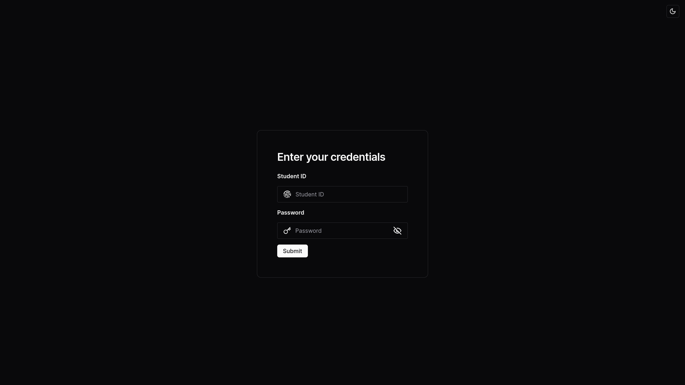
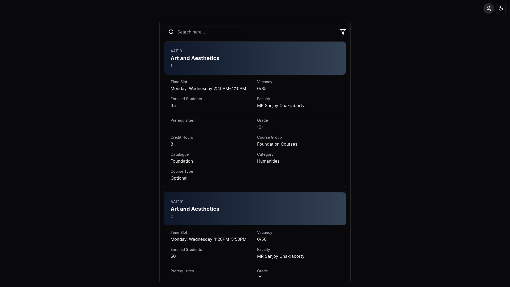
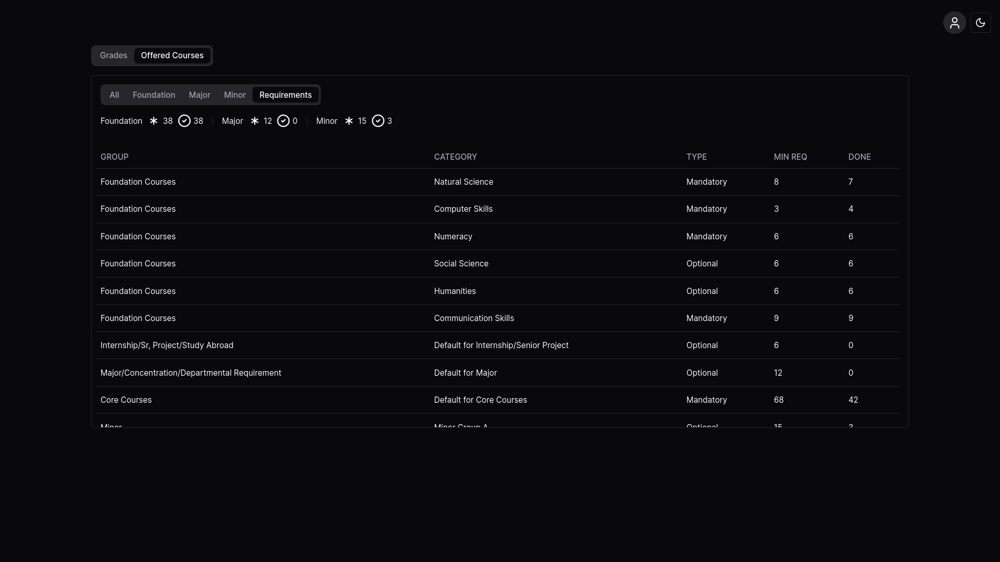

`irasx` is a [React JS](https://react.dev/) based CSR app, focusing on modern style and ease of use.
Leveraging the APIs utilized by [iras](http://www.irasv1.iub.edu.bd/#/) it seamlessly retrieves data for enhanced functionality. Checkout the deployed version of [irasx](https://irasx.vercel.app/).

<hr>

Major Dependencies -

-   [shadcn](https://ui.shadcn.com/) - for ui components
-   [tailwindcss](https://tailwindcss.com/) - for styling
-   [react-pdf](https://github.com/diegomura/react-pdf) - for pdf generation

<hr>

Some screenshots of the users interface -




<hr>

To run the project locally follow these steps -
1. Clone the repository and change the directory
```bash
git clone https://github.com/iZafor/irasx.git
cd irasx
```
2. Install dependencies
```bash
npm install
```
3. Run the project
```
npm run dev
```

`Note:` Due to CORS restriction current version of the project is unusable. 
